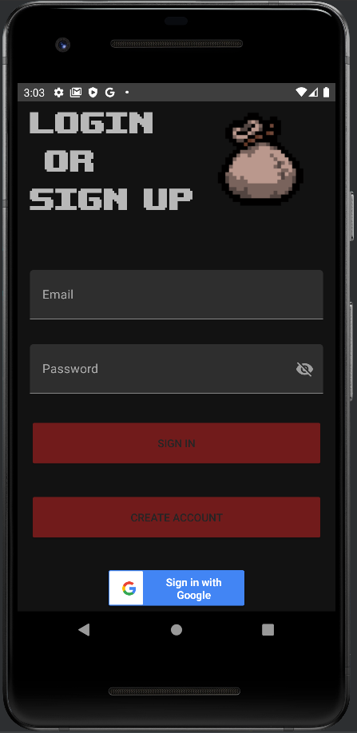
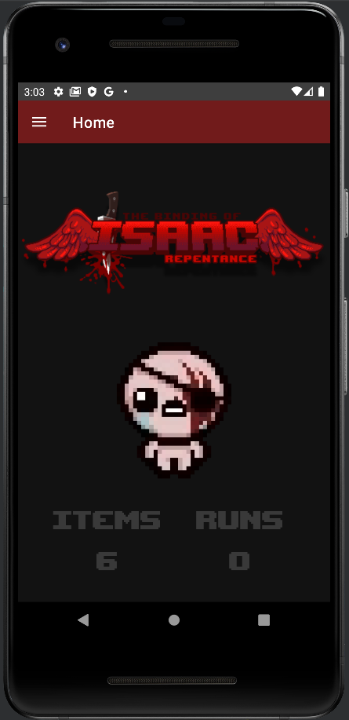
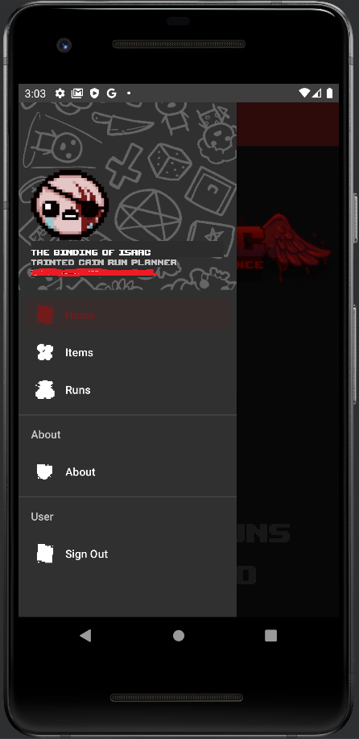
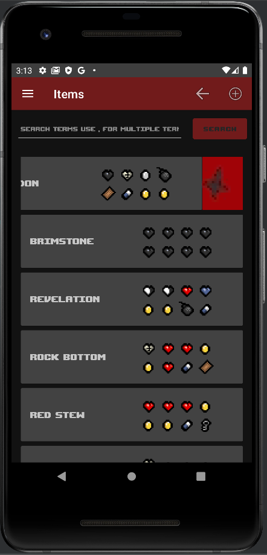
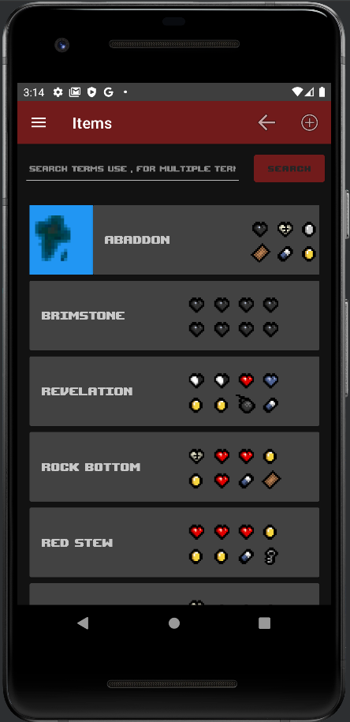
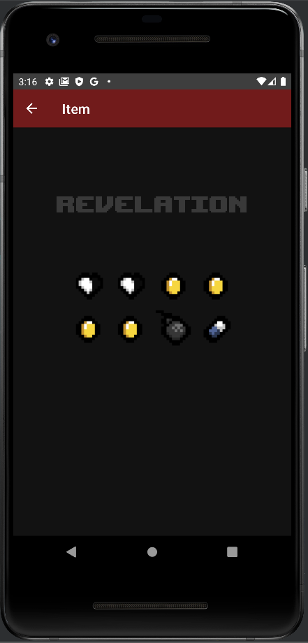
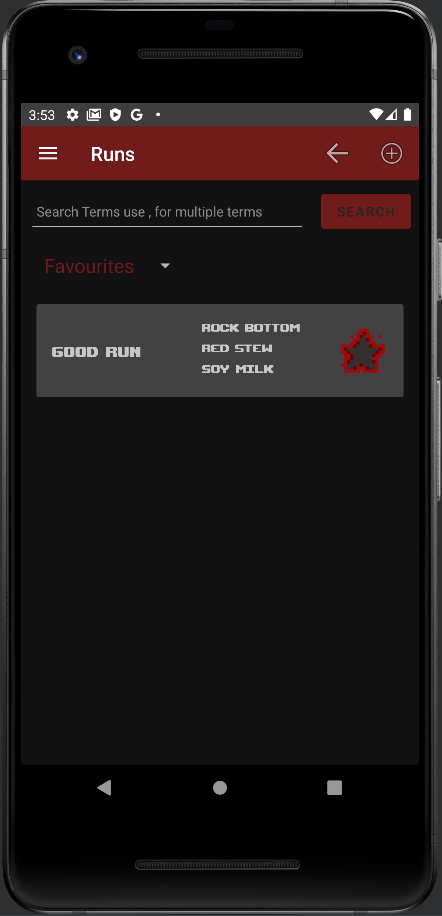
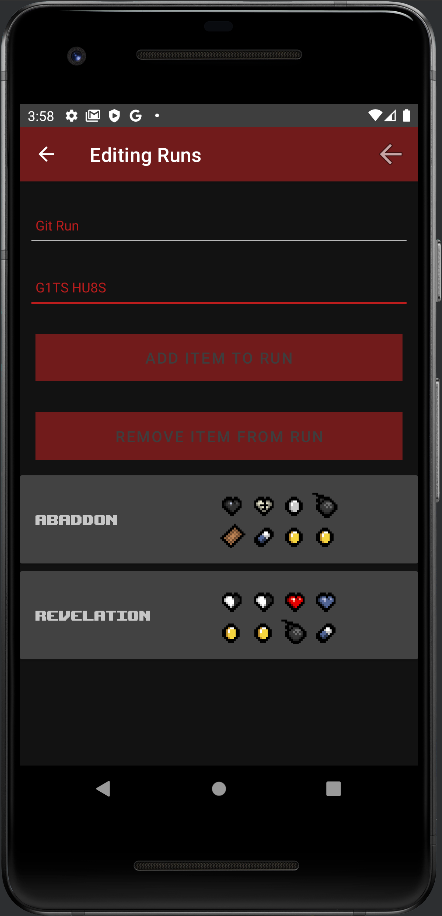

# Binding of Isaac : Tainted Cain Run Planner
### Introduction
This is a repository for a mobile app project that I created. The premise of this app is to allow users to create, store  and share runs for the character Tainted Cain from the Binding of Isaac. The app makes use of Google's Firebase to manage users and store runs on a real-time database.

This app was created for my Mobile App Development modules, where it was originally created as a command-line CRUD app while learning the basics of Kotlin, it was then developed into a basic app using Android Studio. This version only made use of activities and did not have per account runs. 

I decided to do Mobile App Development 2 as my elective, where I got the chance to further expand the app, adding user management and a database along with changing the app to follow the MVVM design pattern.

All the local data in the app such as pickups and items are stored on the device using GSON, Googles JSON library for Kotlin.
### Background
This app is for the game [Binding of Isaac: Rebirth](https://store.steampowered.com/app/250900/The_Binding_of_Isaac_Rebirth/). During their expansion Repentance they added variants of the default characters into the game, one being [Tainted Cain](https://bindingofisaacrebirth.fandom.com/wiki/Tainted_Cain). Throughout the game the player can pick up items to become stronger, Cain however cannot pick up items, but must combine a collection of 8 pickups to craft an item. 
The items recipes are seeded during the start of the run, so inputting the same seed will result in the same recipes. This app allows users to share their runs with others, where a run is a collection of items, and each item is a collection of 8 pickups.
### Signing In
When launching the app, users are prompted to create an account, alternatively they can also sign in using Google Authentication. All the user accounts are manged using Firebase Authentication. Once they are signed in they are greeted with some statistics, such as how many runs and items they've created. They can then access the side navigation menu where they can return to home, create items, runs, view the about section or sign out.

### Items
Items are stored locally on the device, as they are a per run basis very few runs will have the same combination of items. When visiting items the user is presented with the list of items currently on the device. They can create a new items by pressing the + on the menu, or they can delete/edit an item by either swiping the item left/right. To get a clearer view of the item, they can also press on the item, bringing them to another fragment where it is just the item name and the pickups.

When creating an item, the user must enter an item name, they select the 8 pickups using a list of spinners which contain all the pickups. The pickups are stored in a JSON file, which is created automatically on the app startup if the file doesn't already exist. Finally they press create item which saves the item on the device. Editing an item will bring them to this fragment as well, however the fields will already be filled out, the user can then change what they please before updating it.
### Runs
Runs are not stored locally, but instead stored on a real-time database on Firebase. When pressing on runs, the user is brought to a list of runs, and features some extra options when compared to items. They can view all runs, their runs or their favourite runs. The runs have similar traits to items, where the user can swipe to edit/delete and create a new run, but now they also have the option to favourite using the star icon, doing so will add the run to the users favorites.

When creating a run the user is asked for a run name and the seed of the run. They can then press add item, which will display the list of items from which they can select from. When pressing on an item it is then added to the run. Similarly they can press remove item, which will show the list of items in the run, and again then can press on it but this time it will remove it. Once they're finished they can scroll to the bottom and add run.

### Searching
Throughout the runs and items there is a search bar than can be used. This search bar allows for searching using multiple terms. Not only can you search by name you can also search by pickups or items. By separating the terms using a ',' you can search for items containing certain pickups or runs containing certain items.
This feature for runs is still buggy, and requires the user to refresh the page to search all the runs again.
